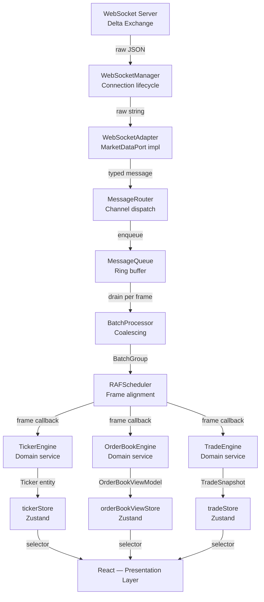
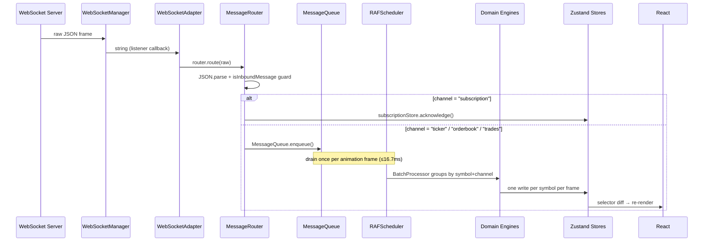

# Architecture — Real-Time Crypto Trading Dashboard

> **Engineering Design Document and Decision Log**  
> Status: Living document. Updated as phases are completed.  
> Target audience: Senior frontend engineers reviewing this codebase.

---

## Table of Contents

1. [Project Overview](#1-project-overview)
2. [Goals](#2-goals)
3. [Non-Goals](#3-non-goals)
4. [Architectural Principles](#4-architectural-principles)
5. [High-Level Architecture](#5-high-level-architecture)
6. [Folder Structure](#6-folder-structure)
7. [Layer Responsibilities](#7-layer-responsibilities)
8. [Ports & Adapters](#8-ports--adapters)
9. [Event Flow](#9-event-flow)
10. [Backpressure Strategy](#10-backpressure-strategy)
11. [State Architecture](#11-state-architecture)
12. [Domain Engines](#12-domain-engines)
13. [Symbol Configuration](#13-symbol-configuration)
14. [Performance Strategy](#14-performance-strategy)
15. [Testing Strategy](#15-testing-strategy)
16. [Development Phases](#16-development-phases)
17. [Engineering Decisions](#17-engineering-decisions)
18. [Known Risks](#18-known-risks)
19. [Future Improvements](#19-future-improvements)
20. [References](#20-references)

---

## 1. Project Overview

This application is a production-grade real-time crypto trading dashboard targeting the Delta Exchange WebSocket API. It renders live order books, tickers, and trade feeds for multiple perpetual futures symbols simultaneously.

The core engineering challenge is not UI complexity — it is **throughput**. At peak market volatility, the Delta Exchange WebSocket delivers 200+ messages per second across ticker, orderbook, and trades channels. A naively written React application would respond to each event with an immediate state write and render cycle, burning through the 16.7ms frame budget within milliseconds and producing a jank-heavy, CPU-bound experience.

This codebase treats that throughput problem as a first-class architectural concern. Every layer boundary and design decision exists in direct response to it:

- **Infrastructure** owns the raw WebSocket connection and nothing else.
- **Application** owns message routing, batching, and scheduling.
- **Domain** owns business logic: order book state machines, spread calculations, trade aggregation.
- **React** is the final recipient of coalesced, frame-aligned state — never the message handler.

The architecture is designed for **maintainability** (clean boundaries mean changes are localized), **testability** (domain and application layers are framework-free), and **scalability** (adding a new symbol or channel requires no structural changes).

---

## 2. Goals

| Goal | Description |
|------|-------------|
| **Single WebSocket connection** | One persistent connection serves all subscriptions. No per-component connections. |
| **State isolation** | Each store holds one concern. A ticker update never causes an order book component to re-render. |
| **Zero unnecessary re-renders** | React only renders when state relevant to a component's selector changes. |
| **High-frequency processing** | The pipeline must sustain 200+ messages/second without dropping state or blocking the main thread. |
| **Testable business logic** | Domain engines and use cases have zero framework dependencies. They are pure TypeScript functions testable with a standard runner. |
| **Clean separation of concerns** | No cross-layer imports. Infrastructure never imports domain; domain never imports React. |
| **Production-grade architecture** | Explicit contracts between layers (ports), documented invariants, and a clear extension path for new features. |

---

## 3. Non-Goals

The following are explicitly out of scope for this implementation. Excluding them is a deliberate choice to keep the architecture focused on its stated performance and data pipeline goals.

| Non-Goal | Reason Excluded |
|----------|-----------------|
| **Authentication / authorization** | Not relevant to a read-only market data dashboard. |
| **Order placement / trading execution** | Out of scope; requires separate risk and order management infrastructure. |
| **Backend services** | This is a pure frontend application. All data comes from the exchange WebSocket. |
| **Charting (OHLCV, candlesticks)** | Charting libraries introduce significant bundle weight and a separate rendering pipeline; excluded to keep the architecture focused. |
| **Mobile / responsive layout** | The order book panel requires minimum viewport width to be legible. Mobile is a future consideration. |
| **Server-side rendering** | The application is entirely event-driven from a WebSocket. SSR would produce a meaningless initial snapshot. |
| **Multi-exchange aggregation** | Only Delta Exchange is targeted. Aggregation is architecturally possible (swap adapters) but not planned. |

---

## 4. Architectural Principles

### Feature-Based Folder Layout

Features are grouped by product domain (`features/orderBook`, `features/ticker`, `features/trades`) rather than by technical type (`components/`, `hooks/`, `utils/`). This co-locates everything a feature needs and makes it possible to reason about — and delete — a feature without grepping the entire tree.

### Clean Architecture + Lightweight Hexagonal Architecture

The dependency rule is strictly enforced: **inner layers never import outer layers**.

```
Domain (innermost) ← Application ← Infrastructure / React (outermost)
```

The domain layer has no knowledge of WebSockets, Zustand, React, or any runtime I/O. This is not an academic exercise — it means domain logic is testable with `node --test` and no browser environment, and it means the infrastructure can be swapped without touching business logic (e.g., replacing the Delta Exchange adapter with a Binance adapter requires only a new `WebSocketAdapter` implementation).

### Event-Driven Design

The pipeline is push-based throughout: the WebSocket pushes messages → the router dispatches → the queue buffers → the scheduler drains → engines process → stores update → React renders. No component polls for data. This prevents the coordination complexity that arises when multiple consumers need to synchronize around a shared pull boundary.

### Domain-First Approach

Domain entities (`OrderBook`, `Ticker`, `Trade`) and value objects (`Price`, `MarketSymbol`) are defined before any infrastructure exists. The domain defines the shape of truth; infrastructure adapts external data into that shape. This eliminates a common failure mode where the shape of truth is defined by the API response format and bleeds throughout the application.

### React as the Presentation Layer

React does not drive the application. It does not own the WebSocket lifecycle, subscription logic, or message processing. React components read from Zustand stores via selectors and render what they find. The entire pipeline — connection management, message routing, domain processing, store writes — runs independently of the React tree. This allows the pipeline to process messages at full WebSocket frequency while React renders at the browser's frame rate.

---

## Layer Dependency Rules

This section defines the project's import boundaries and architectural constraints. It is the **single source of truth** that all future implementation phases must follow.

> **Note for Claude Code:** All future Claude Code implementation phases must read and comply with these Layer Dependency Rules before generating any code.

---

### Dependency Direction

The project enforces a strict, one-way dependency direction:

```
Presentation (React)
       ↓
  Application
       ↓
    Domain
```

- **Infrastructure** implements Domain Ports and depends on Domain interfaces.
- **Domain** must never depend on Infrastructure.
- **React** must never contain business logic.

---

### Composition Root

Only the Composition Root (`App` / Providers / Bootstrap) is allowed to wire together:

- Infrastructure
- Application
- Domain

No other layer should manually instantiate infrastructure services. Use dependency inversion.

---

### App Layer

**May import:** `application`, `features`, `shared`

**Must not directly import:** domain services, infrastructure adapters

**Responsibility:** application bootstrap and dependency composition.

---

### Features

Each feature owns its UI (Ticker, OrderBook, Trades).

**May import:** `application`, `shared`, domain models

**Must NOT import:** infrastructure, other feature internals

Communication between features must go through the Application Layer.

---

### Application Layer

Application coordinates workflows.

**May import:** `domain`, `shared`

**Must NOT import:** React, feature components, browser APIs

**Contains:** use cases, message routing, orchestration, scheduling, store coordination

Application must not contain business calculations.

---

### Domain Layer

The Domain Layer contains all business logic.

**May contain:** Entities, Value Objects, Domain Services, Calculators, Ports, pure utilities

**May import:** `shared` types

**Must NEVER import:** React, Zustand, WebSocket, LocalStorage, browser APIs, infrastructure, feature components

The Domain Layer must remain framework-independent and fully testable.

---

### Infrastructure Layer

Infrastructure implements external systems.

**Contains:** `WebSocketAdapter`, `WebSocketManager`, `SubscriptionManager`, `LocalStorageAdapter`

**May import:** domain ports, `shared`

**Must NOT import:** React components, feature UI

Infrastructure implements interfaces defined by the Domain Layer.

---

### Shared

**Contains:** Types, Constants, Utilities, Framework helpers, Generic hooks

Shared must remain dependency-light. Shared must not depend on feature modules.

---

### State Management

Stores are responsible only for state.

**Stores must NEVER contain:** business rules, grouping, aggregation, calculations, parsing, WebSocket communication

Stores receive processed domain objects.

---

### React Components

Components are responsible only for presentation.

**Components may:** render UI, dispatch actions, read state

**Components must NEVER:** aggregate data, parse WebSocket messages, calculate spreads, group order book levels, compute statistics, contain business rules

---

### High-Frequency Rendering Rule

> **All future Claude Code implementation phases must follow this rule without exception. It is not optional and is not subject to tradeoffs.**

High-frequency data — ticker updates, order book level changes, trade arrivals — must **never** be passed through multiple component levels as props.

**Required pattern:**

| Role | Responsibility | What it receives as props |
|------|---------------|--------------------------|
| **Container component** | Composes layout; renders leaf components | Symbol identity (`TradingSymbol`), configuration — nothing realtime |
| **Leaf component** | Renders a single realtime data point | Symbol identity only — fetches its own slice via selector |

**Correct:**
```tsx
// Container — stable props only
function TickerBar() {
  return SUPPORTED_SYMBOLS.map(s => <TickerCard key={s} symbol={s} />);
}

// Leaf — direct store subscription, not a prop
const TickerCard = memo(function TickerCard({ symbol }: { symbol: TradingSymbol }) {
  const ticker = useTickerStore(s => s.tickers.get(symbol));   // O(1) selector
  // ...
});
```

**Wrong:**
```tsx
// Container — DO NOT DO THIS
function TickerBar() {
  const tickers = useTickerStore(s => s.tickers);              // subscribes to ALL updates
  return SUPPORTED_SYMBOLS.map(s => (
    <TickerCard key={s} symbol={s} ticker={tickers.get(s)} />  // prop-drills realtime data
  ));
}

// Leaf — DO NOT DO THIS
function TickerCard({ symbol, ticker }: { symbol: TradingSymbol; ticker: Ticker }) {
  // re-renders whenever parent re-renders, even if this symbol's data is unchanged
}
```

**Why this rule exists:**

When a container subscribes to `s.tickers` (the whole map), every update to any symbol re-renders the container and cascades to all children. When each leaf subscribes to `s.tickers.get(symbol)`, Zustand's `Object.is` comparison on the selector output means only the leaf whose symbol changed re-renders. This is the difference between O(n) and O(1) re-renders per update — visible in React Profiler as exactly one highlighted component per tick rather than the entire strip.

**Enforcement checklist for every high-frequency component:**

- [ ] Props contain only symbol identity and configuration — no price, quantity, timestamp, or any other realtime field
- [ ] Selector targets the smallest possible slice: `s.tickers.get(symbol)`, not `s.tickers`
- [ ] Component is wrapped in `React.memo`
- [ ] Click/event handlers use `useCallback` with stable dependencies

The `TickerCard` / `PriceDisplay` / `PercentageChange` pattern established in Phase 3 is the canonical template. Apply it identically to `OrderBookRow`, `TradeRow`, and every future high-frequency UI element.

---

### WebSocket Access

Only the communication layer may create or access browser WebSocket objects.

**Allowed classes:** `WebSocketManager`, `SubscriptionManager`, `MessageRouter`

No other file should instantiate `new WebSocket()`.

---

### Business Logic

Business logic belongs exclusively inside domain engines and calculators:

`TickerEngine`, `OrderBookEngine`, `TradeEngine`, `GroupingEngine`, `DepthCalculator`, `SpreadCalculator`, `TradeAggregator`, `RollingStatistics`

Business logic must never exist inside React Components, Stores, or Adapters.

---

### State Flow

The canonical data flow is strictly top-down:

```
WebSocket
    ↓
Infrastructure
    ↓
Application
    ↓
Domain
    ↓
Stores
    ↓
React
```

No layer may bypass another layer.

---

### Architectural Enforcement

#### Development Rules

- Every future implementation must respect these dependency rules.
- New features should integrate into the existing architecture rather than introducing new patterns.
- Avoid circular dependencies.
- Prefer composition over inheritance.
- Keep files focused on a single responsibility.
- Do not bypass the Application Layer.
- React is the presentation layer, not the architecture.

> **All future Claude Code implementation phases must read and comply with these Layer Dependency Rules before generating code.**

---

## 5. High-Level Architecture



---

## 6. Folder Structure

```
src/
├── app/                  # Application bootstrap and global state
│   ├── stores/           # Zustand store definitions
│   └── providers/        # React context providers (WebSocket lifecycle)
│
├── domain/               # Pure business logic — no framework dependencies
│   ├── entities/         # Aggregate roots and entities
│   ├── valueObjects/     # Immutable typed wrappers (Price, MarketSymbol)
│   ├── services/         # Domain services (engines)
│   ├── calculations/     # Pure computation functions (Spread, Depth, Grouping)
│   └── ports/            # Interface contracts defined by the domain
│
├── application/          # Use cases and pipeline orchestration
│   ├── useCases/         # Application-level commands
│   ├── scheduler/        # Backpressure pipeline (MessageQueue, BatchProcessor, RAFScheduler)
│   ├── MessageRouter.ts  # Channel dispatch
│   └── SubscriptionHandler.ts
│
├── infrastructure/       # External system adapters
│   ├── websocket/        # WebSocketAdapter, WebSocketManager, SubscriptionManager
│   ├── storage/          # LocalStorageAdapter
│   └── config/           # Runtime environment configuration
│
├── features/             # React feature modules (co-located by product domain)
│   ├── layout/           # AppShell, grid layout
│   ├── orderBook/        # Order book panel
│   ├── ticker/           # Ticker strip
│   ├── trades/           # Trade feed
│   └── status/           # Connection status bar
│
└── shared/               # Cross-cutting types and constants
    ├── types/            # Shared TypeScript types (market, connection, websocket)
    └── constants/        # Symbol metadata, WebSocket channel names
```

### Why each folder exists

**`app/`** — Zustand stores live here because they are global application state, not feature-local state. Providers that manage connection lifecycle belong here, not inside a feature, because multiple features depend on them.

**`domain/`** — Isolation of business logic is the most important structural decision in this codebase. By placing engines, entities, and calculations in a folder with zero non-`domain/` imports (except `shared/types`), the test surface for correctness is completely decoupled from infrastructure. A regression in `OrderBookEngine` is caught by a unit test with no WebSocket setup required.

**`application/`** — Use cases coordinate infrastructure and domain without knowing about either's concrete implementation. The scheduler sub-package belongs here because it is an application-layer concern: it decides when domain engines run, not how they compute.

**`infrastructure/`** — The only place that imports `WebSocket`, `localStorage`, or other browser/network APIs. If the exchange changes its wire format, only this folder changes.

**`features/`** — Co-location of component, styles, and feature-specific hooks. A feature can be removed by deleting one folder. Features import from `domain/`, `application/`, and `shared/` but never from other features.

**`shared/`** — Types and constants that are referenced across layer boundaries (e.g., `TradingSymbol` is used in domain entities, application use cases, infrastructure adapters, and React components). Keeping them separate prevents circular imports.

---

## 7. Layer Responsibilities

| Layer | Responsibility | Depends On | Must Not Know About | Examples |
|-------|---------------|------------|---------------------|---------|
| **Domain** | Business logic, invariants, entity state machines | `shared/types` only | React, Zustand, WebSocket, fetch, localStorage | `OrderBookEngine`, `Price`, `Spread.calculate()` |
| **Application** | Use case orchestration, message routing, backpressure scheduling | Domain ports, `shared/types` | React, Zustand, concrete adapters | `SubscribeMarketUseCase`, `MessageRouter`, `RAFScheduler` |
| **Infrastructure** | Adapter implementations for external systems | Application ports, `shared/types` | Domain entities (only raw types), React | `WebSocketAdapter`, `WebSocketManager`, `SubscriptionManager`, `LocalStorageAdapter` |
| **Stores (`app/stores`)** | Reactive state container; bridge between pipeline and React | Domain entities, `shared/types` | WebSocket, domain engines directly | `tickerStore`, `orderBookStore` |
| **Features (React)** | UI rendering and user interaction | Stores (via selectors), `shared/types` | Application internals, infrastructure, domain engines | `OrderBookPanel`, `TickerStrip` |

---

## 8. Ports & Adapters

The application uses a lightweight interpretation of Hexagonal Architecture. Ports are TypeScript interfaces defined inside `domain/ports/`. Adapters implement those interfaces in `infrastructure/`. The application layer references ports only — never concrete adapters.

### `MarketDataPort` — Inbound Driving Port

```typescript
// domain/ports/MarketDataPort.ts
export interface MarketDataPort {
  onTicker(handler: TickerHandler): void;
  onOrderBook(handler: OrderBookHandler): void;
  onTrades(handler: TradesHandler): void;
  subscribe(symbol: TradingSymbol, channel: Channel): void;
  unsubscribe(symbol: TradingSymbol, channel: Channel): void;
  connect(): void;
  disconnect(): void;
}
```

**Why it exists here:** The domain defines the data contract it needs from the outside world. Infrastructure satisfies that contract. This inverts the dependency: infrastructure depends on domain, not the other way around. A `MockMarketDataAdapter` implementing this interface can replay fixture messages in tests with zero WebSocket infrastructure.

### `StoragePort` — Outbound Driven Port

Defines the contract for persisting user preferences (selected symbol, grouping level). The concrete implementation (`LocalStorageAdapter`) is injected at startup. This allows tests to inject an in-memory store without touching `localStorage`.

### `WebSocketAdapter` — Infrastructure Adapter *(Implemented)*

Implements `MarketDataPort`. Constructed with three collaborators — `MessageRouterPort`, `WebSocketManager`, and `SubscriptionManager` — and wired by the composition root via `initialize()`. The constructor is side-effect-free; `initialize()` registers the raw message listener on `WebSocketManager`, the reconnect replay hook on `WebSocketManager` (delegating to `SubscriptionManager.replayAll()`), and the per-channel handlers on `MessageRouter`. `subscribe()` and `unsubscribe()` delegate entirely to `SubscriptionManager`. Components and use cases never import this class directly — they hold a `MarketDataPort` reference.

### `SubscriptionManager` — Infrastructure Service *(Implemented)*

Owns the desired subscription set — the channels and symbols the application has requested but which may or may not yet be acknowledged by the exchange. Responsibilities:

- Maintain the `desired` Map keyed by `${symbol}:${channel}`
- Deduplicate subscribe calls (no duplicate sends)
- Build and send `subscribe` / `unsubscribe` payloads via `WebSocketManager.send()`
- Implement `replayAll()` — send all desired subscriptions in one batched message after reconnect

`SubscriptionManager` is the single source of truth for subscription *intent*. `subscriptionStore` is the source of truth for server-*acknowledged* subscriptions. They are deliberately separate: a symbol can be desired before the socket opens and acknowledged only after the exchange confirms.

### `LocalStorageAdapter` — Infrastructure Adapter *(Implemented)*

Implements `StoragePort`. Wraps `localStorage` with typed get/set. Isolated here so the storage mechanism can be replaced (e.g., with `IndexedDB`) without touching application or domain code.

### Dependency Inversion Summary

```
Application layer           Infrastructure layer
─────────────────           ──────────────────
  MarketDataPort    ←────   WebSocketAdapter (implements it)
  StoragePort       ←────   LocalStorageAdapter (implements it)
```

The arrows point inward — infrastructure depends on the port contract defined by the domain/application, not the reverse.

---

## 9. Event Flow

### Current Flow (Active)



---

## 10. Backpressure Strategy

### Problem

React re-renders are synchronous. If a Zustand store write occurs on every WebSocket message, and the exchange delivers 200 messages per second, the React tree evaluates 200 times per second — 12× over the 16.7ms frame budget at 60fps. This produces visual jank, high CPU usage, and dropped frames even on capable hardware.

### Solution: Three-Stage Pipeline

```
Incoming WebSocket frames (200+/sec)
           ↓
    MessageQueue (ring buffer, O(1) enqueue)
           ↓
    BatchProcessor (coalesce per symbol × channel)
           ↓
    RAFScheduler (drain once per animation frame)
           ↓
    Domain Engine (process BatchGroup)
           ↓
    Zustand Store (ONE write per panel per frame)
           ↓
    React (ONE render per panel per frame)
```

### Stage Details

**`MessageQueue<T>`** — a fixed-capacity circular ring buffer. `enqueue()` is O(1). When the buffer is full, the oldest entry is overwritten. This is an intentional backpressure decision for trading data: a ticker price from 100ms ago has zero value; only the current price matters. The capacity is tuned to hold approximately 2 frames of peak traffic (≈ 7 messages at 200/sec × 16.7ms) with headroom.

**`BatchProcessor`** — groups all messages drained in a single frame by `(symbol, channel)` pair. Per-channel batching strategies:

| Channel | Strategy | Reason |
|---------|----------|--------|
| `ticker` | `last-wins` | Only the most recent price is meaningful. Intermediate values are discarded. |
| `orderbook` | `ordered-sequence` | Deltas must be applied in sequence order. All deltas in a frame are applied to reconstruct correct state. |
| `trades` | `accumulate-all` | Every trade is a discrete event and must be appended to the feed. |

**`RAFScheduler`** — drives the drain-process-write loop via `requestAnimationFrame`. Per-frame frame budget: 16.7ms at 60fps. A performance guard (Phase 5) measures domain processing time with `performance.now()`. If processing exceeds 8ms (half the budget), the scheduler defers to the next frame to prevent jank.

### Implementation Status

The backpressure pipeline is fully active. `MessageQueue`, `BatchProcessor`, and `RAFScheduler` are implemented and wired in `WebSocketProvider`. All market data (ticker, order book, trades) flows through the queue and is drained once per animation frame.

Per-frame behavior:
1. `queue.drain()` — pull all enqueued messages for this frame
2. `batchProcessor.process(messages)` — group by `(symbol, channel)`, apply per-channel strategy
3. Engine processes each `BatchGroup` → produces updated entities
4. Publishers (`TickerPublisher`, `OrderBookPublisher`, `TradePublisher`) write to stores at most once per symbol per frame
5. React renders once per component per frame — not once per message

---

## 11. State Architecture

All global application state lives in Zustand stores. Stores are isolated by concern. No store imports another store.

### `connectionStore` *(Implemented)*

Tracks WebSocket connection lifecycle state: `disconnected | connecting | connected | reconnecting | error`. Written exclusively by `WebSocketManager`. Read by `ConnectionStatusBar`.

**Why isolated:** Connection state changes frequently and independently of market data. Isolating it prevents market data re-renders from triggering connection UI updates and vice versa.

### `subscriptionStore` *(Implemented)*

Tracks which `(symbol, channel)` pairs are currently acknowledged by the exchange. Written by `SubscriptionHandler`. Read by components that need to conditionally render loading states.

**Why isolated:** Subscription state is control-plane metadata. It has no business being colocated with ticker prices.

### `tickerStore` *(Implemented — shell)*

```typescript
{ tickers: ReadonlyMap<TradingSymbol, Ticker> }
```

Selector pattern for render isolation:

```typescript
const ticker = useTickerStore(s => s.tickers.get('BTCUSD'))
```

Zustand's `subscribeWithSelector` compares selector output via `Object.is`. When ETHUSD updates, the `BTCUSD` selector returns the same reference — no re-render. The `upsert(ticker)` action (Phase 2) writes a new `Map` with a new entry reference for the updated symbol only.

### `orderBookStore` *(Implemented — shell)*

```typescript
{ books: ReadonlyMap<TradingSymbol, OrderBook> }
```

Same selector isolation as `tickerStore`. `applySnapshot()` and `applyDelta()` actions are planned for Phase 3. These actions call `OrderBookEngine` and write the resulting `OrderBook` entity.

**Data structure rationale:** `OrderBook.bids` and `OrderBook.asks` are stored as `readonly [price, size][]` tuples rather than `Map<number, number>`. Arrays give O(1) iteration for rendering (which dominates at 60fps), at the cost of O(log n) insertion for deltas. At 50 deltas/sec × 20 levels = 1,000 potential level operations/second, tuple arrays also eliminate per-entry object allocation overhead that accumulates under the GC.

### `tradeStore` *(Implemented — shell)*

```typescript
{ trades: ReadonlyMap<TradingSymbol, readonly Trade[]> }
```

Trades are append-only. Phase 4 will introduce a rolling window cap (configurable, default 50 trades per symbol) to prevent unbounded memory growth.

---

## 12. Domain Engines

Domain engines are stateless pure services. They receive current state and an incoming message; they return new state. No engine holds mutable state internally. The caller (application layer) owns the current entity and passes it in on each call.

### `TickerEngine` *(Phase 2 — Planned)*

**Planned responsibilities:**
- Parse and validate raw ticker message fields
- Produce an immutable `Ticker` entity with typed fields
- Compute `change24h`, `changePercent24h`, and `priceDirection` (up/down/flat) for UI indicators

### `OrderBookEngine` *(Phase 3 — Planned)*

**Planned responsibilities:**
- `applySnapshot(message): OrderBook` — replace full book state, reset sequence counter
- `applyDelta(current, message): OrderBook` — validate sequence continuity, merge delta levels, maintain sort invariants (bids descending, asks ascending), cap at `MAX_DEPTH` levels
- `isValidSequence(book, next): boolean` — drop out-of-sequence deltas and signal that a fresh snapshot is needed

**Sequence validation:** Delta messages that arrive out-of-sequence indicate a missed message (gap in the stream). The correct response is to request a new snapshot, not to apply the delta anyway. `isValidSequence` provides this check. It is the only implemented method on `OrderBookEngine`.

### `TradeEngine` *(Phase 4 — Planned)*

**Planned responsibilities:**
- Parse raw trade messages into typed `Trade` entities
- Maintain a rolling window of trades per symbol (bounded list)
- Compute rolling statistics for the trades panel

### Domain Calculation Functions *(Implemented — Phase 1)*

Pure functions with no side effects. Tested independently.

| Module | Purpose |
|--------|---------|
| `Spread.ts` | Compute bid-ask spread and spread percentage |
| `Depth.ts` | Compute cumulative depth at price levels |
| `Grouping.ts` | Snap price levels to the active grouping increment |
| `Imbalance.ts` | Compute bid/ask volume imbalance ratio |

These are separate from engines intentionally: engines are stateful (they apply messages to evolving entities); calculations are stateless (they project a snapshot of an entity into a derived value).

---

## 13. Symbol Configuration

All symbol metadata is centralized in `shared/constants/symbols.ts` as a single `SYMBOL_CONFIG` record. No component, engine, or formatter hardcodes precision values or grouping options.

```typescript
BTCUSD: {
  symbol: 'BTCUSD',
  displayName: 'BTC / USD',
  displayPrecision: 1,    // digits shown in UI
  pricePrecision: 2,      // raw precision from exchange
  quantityPrecision: 6,
  allowedGroupings: [0.1, 0.5, 1, 2.5, 5, 10, 25, 50, 100],
  defaultGrouping: 1,
}
```

**Why centralized:**

- `displayPrecision` and `pricePrecision` differ. BTCUSD prices come from the exchange with 2 decimal places but the UI rounds to 1 for readability. Hardcoding this in a component means updating it in N places when exchange precision changes.
- `allowedGroupings` are sourced from exchange documentation. The order book grouping control renders exactly this list. Adding a new grouping step requires one config change.
- `MarketSymbol` value object validates that a string is a supported symbol by checking it against `SYMBOL_CONFIG` keys. Invalid symbols are rejected at the application layer before reaching the domain.

**Infrastructure vs. business config:** `INFRASTRUCTURE_CONFIG` (`infrastructure/config/SymbolConfig.ts`) holds deployment-time config (`VITE_WS_URL`, debug flags). `SYMBOL_CONFIG` is business domain config. They are intentionally separate — infrastructure config can change between environments; symbol metadata does not.

---

## 14. Performance Strategy

### Decisions Deferred Intentionally

The following optimizations are architecturally planned but not yet implemented. They are deferred because:

1. The data pipeline (Phase 5) must be in place before rendering optimizations are meaningful — profiling render frequency before establishing frame-aligned batching would produce misleading baselines.
2. Premature optimization at the React layer would introduce complexity before correctness is established.

| Optimization | Why Deferred | Target Phase |
|-------------|-------------|-------------|
| `requestAnimationFrame` batching | Requires `RAFScheduler` + `MessageQueue` | Phase 5 |
| Ring buffer `MessageQueue` | Requires pipeline integration | Phase 5 |
| `Map`-based order book delta merging | Requires `OrderBookEngine` implementation | Phase 3 |
| Memoized selectors (`useShallow`, custom equality) | Effective only after render frequency is measured | Phase 6 |
| `React.memo` on panel components | Same as above | Phase 6 |
| Row virtualization (order book depth) | Requires real data volume to measure need | Phase 6 |
| CSS-driven price flash animations | Requires real ticker data | Phase 3 |
| Time-windowed trade queue | Requires `TradeEngine` | Phase 4 |
| Frame budget guard (`performance.now()`) | Part of `RAFScheduler` implementation | Phase 5 |

### Decisions Already Made for Performance

- **Tuple arrays for order book levels** — `[price, size][]` instead of `{price, size}[]` eliminates object allocation per level at update frequency.
- **`ReadonlyMap` in stores** — prevents accidental mutation; ensures reference stability for unchanged symbols in `Object.is` selector comparisons.
- **`subscribeWithSelector` middleware** — Zustand's built-in support for granular subscriptions. Without it, every store update would re-render all subscribers.
- **Channel isolation in `MessageRouter`** — unknown channel messages are dropped at parse time; they never reach domain code or trigger store writes.
- **Direct leaf subscriptions** — high-frequency components (`TickerCard`, `OrderBookRow`, `TradeRow`) subscribe directly to their own data slice; containers pass only symbol identity as props. See [High-Frequency Rendering Rule](#high-frequency-rendering-rule).

---

## 15. Testing Strategy

### Unit Tests — Domain Layer

Domain engines, calculation functions, and value objects are pure TypeScript with no browser or framework dependencies. They are testable with `node:test` or Vitest with no setup overhead.

Target coverage:
- `OrderBookEngine`: snapshot application, delta merging, sequence validation, out-of-sequence rejection, price level removal (size = 0), max depth cap
- `TickerEngine`: field parsing, direction computation, edge cases (zero volume, negative change)
- `TradeEngine`: rolling window bounds, trade entity construction
- `Spread`, `Depth`, `Grouping`, `Imbalance`: property-based tests with boundary values

### Engine Integration Tests

Test the full pipeline path without React: feed raw WebSocket message fixtures through `MessageRouter → handler → Engine → Store`. Assert store state after N messages. No mocking of intermediate layers.

### Application Layer Tests

Test use cases with a `MockMarketDataAdapter` implementing `MarketDataPort`. Assert that `SubscribeMarketUseCase.subscribe()` calls the port's `subscribe()` with the correct arguments. Assert that invalid symbols are rejected before reaching the port.

### Stress / Throughput Tests

Replay recorded high-volatility message streams (200+ msg/sec) through the full pipeline (excluding React render). Measure:
- Message processing latency (p50, p99)
- Frame budget consumption per tick
- Memory growth over a 60-second window

These tests validate the backpressure pipeline and establish regression baselines before React rendering is profiled.

### Component Tests *(Phase 6)*

Render individual panels with pre-seeded stores. Assert DOM output reflects store state. No WebSocket, no engine calls. Isolated to presentation logic only.


## 16. Engineering Decisions

| Decision | Reason | Tradeoff |
|----------|--------|----------|
| **Zustand over Redux** | Minimal boilerplate, selector-native subscriptions, no `Provider` wrapping required, `subscribeWithSelector` enables surgical re-renders out of the box. | Smaller ecosystem; less enforced structure. Mitigated by explicit store interface types. |
| **Vite over CRA / webpack** | Sub-second HMR for a project with domain-heavy TypeScript; native ESM in dev eliminates bundle step latency. | Vite's production build uses Rollup; webpack ecosystem plugins unavailable. No material impact for this project. |
| **React over other frameworks** | Dominant ecosystem for trading UIs; `subscribeWithSelector` middleware on Zustand is well-tested against React's reconciler; interview context assumes React familiarity. | React's diffing is not optimal for fixed-layout high-frequency numerical updates. Mitigated by RAF batching + `React.memo`. |
| **Hexagonal Architecture** | Decouples the domain from infrastructure. The exchange adapter, storage mechanism, and test fixtures are all interchangeable behind port interfaces. | More indirection than a flat structure. Justified: without it, changing the WebSocket message format requires touching domain code. |
| **`requestAnimationFrame` scheduler** | Aligns all store writes with the browser's paint cycle. Prevents mid-frame state mutations, reduces render count from 200/sec to 60/sec. | Adds latency (max ~16ms per message before processing). Acceptable for market data; would not be acceptable for order placement confirmations. |
| **Tuple arrays for order book levels** | `[price, size][]` avoids per-level object allocation. At 50 deltas/sec × 20 levels, object allocation overhead compounds under GC. Arrays also give O(1) indexed iteration for rendering. | Less readable than `{price, size}[]`. Mitigated by the `PriceLevel` type alias and clear naming. |
| **Domain-defined ports** | Prevents the anti-pattern of defining ports in the infrastructure layer and having the domain adapt to them. The domain specifies what data it needs; infrastructure satisfies the contract. | Requires more discipline to maintain. Enforced by ESLint import restrictions (planned Phase 1 follow-up). |
| **Ring buffer with overwrite on full** | For market data, the only message that matters is the most recent. Dropping stale messages under backpressure is correct domain behavior, not a failure mode. | A naive observer would interpret overwrites as data loss. Documented explicitly here to prevent future engineers from treating it as a bug. |
| **`ReadonlyMap` in store state** | Prevents accidental mutation of store state outside of Zustand actions. Zustand's `immer` middleware is not used — all updates produce new Map instances explicitly to guarantee reference stability for selectors. | Slightly more verbose update code. Explicit is safer here. |

---

## 17. Technical Debt

> Populated during development. Items added here are known compromises, not bugs.


## 18. Known Risks

| Risk | Likelihood | Impact | Mitigation |
|------|-----------|--------|-----------|
| **High-frequency WS traffic saturating main thread** | High (BTC perpetual at peak volatility) | Jank, dropped frames, CPU throttle | RAF batching + MessageQueue backpressure (Phase 5) |
| **Memory growth from unbounded trade lists** | Medium | Tab OOM crash over long sessions | Rolling window cap in `tradeStore` (Phase 4) |
| **Order book sequence gaps causing stale state** | Medium | Incorrect bids/asks displayed | Sequence validation in `OrderBookEngine` + snapshot re-request (Phase 3/9) |
| **Subscription desync on reconnect** | Medium | Missing data feeds post-reconnect | `SubscriptionManager.replayAll()` fires on every socket open via a ready listener on `WebSocketManager` — desired subscriptions are replayed automatically. Server ack tracking remains in `subscriptionStore` via `SubscriptionHandler`. |
| **Render storms on symbol switch** | Low-Medium | Momentary UI freeze during navigation | Store reset before subscribe + transition state (Phase 7) |
| **WebSocket message format changes by exchange** | Low | Parse failures, silent data drop | Typed parse guards in `MessageRouter`; exchange changelog monitoring |

---

## 19. Future Improvements

The following ideas are architecturally coherent with the current design but intentionally out of scope.

- **Web Workers** — Move `OrderBookEngine` and `BatchProcessor` off the main thread. The stateless engine design makes this straightforward: pass messages via `postMessage`, receive entities back. Eliminates frame budget contention entirely.
- **`SharedArrayBuffer` for order book state** — Zero-copy transfer of price level arrays between worker and main thread. Requires COOP/COEP headers.
- **`OffscreenCanvas` for depth chart** — Render the order book depth curve in a worker, eliminating GPU upload overhead from the main thread.
- **`IndexedDB` snapshots** — Persist the last known order book state across page loads. Eliminates the 1–2 second cold-start window where the book is empty.
- **Server-sent reconciliation** — Compare local order book sequence against exchange's canonical state endpoint to detect and recover from long-running drift.
- **Metrics dashboard** — Internal panel exposing pipeline throughput (messages/frame), RAF frame duration, store write frequency. Useful during performance debugging.
- **Multi-exchange adapter** — The `MarketDataPort` interface is exchange-agnostic. A Binance adapter would require a new `WebSocketAdapter` implementation and a format translator.

---

## 20. References

> Populated as useful references are identified during development.
