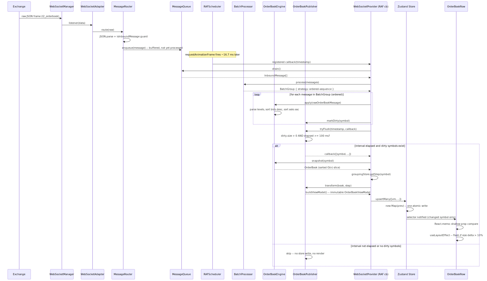

# Architecture Diagrams

Production-grade cryptocurrency trading terminal — Delta Exchange WebSocket feed.

---

## 1. High-Level Architecture

**Four strict layers — dependency arrows always point inward toward Domain.** Infrastructure implements Domain ports; Presentation reads from Application-populated Zustand stores. No layer imports from a layer above it. `WebSocketAdapter` is wiring glue: it bridges `WebSocketManager` → `MessageRouter` and `SubscriptionManager`; it does not process data.

---

## 2. Real-time Data Flow (Full)

**Three distinct engine+publisher patterns run in parallel each frame:**
- **Ticker** — stateless engine returns entity directly; Publisher buffers in a `Map` (latest-wins naturally).
- **Order book** — stateful engine accumulates full snapshot; Publisher tracks dirty symbols; ViewModel built inside the flush callback.
- **Trades** — stateful engine aggregates into bounded rolling history; same dirty/flush pattern as order book.

---

## 3. Order Book Flow

**Important:** `buildViewModel` is called inside the RAF callback (WebSocketProvider) — the Publisher does not call it. `OrderBookPublisher.transform(book, step)` is a thin delegation to `buildViewModel`, invoked by the orchestrating RAF callback. The Publisher's role is throttle-gate + utility; the RAF callback handles snapshot retrieval, grouping-step lookup, and store write.

---

## 4. Trades Flow

`accumulate-all` ensures every trade is applied to the engine even when multiple arrive in one frame. Aggregation and memory-bounding are domain concerns inside `TradeEngine`; the caller never sees raw array mutations — `snapshot()` always returns a fresh immutable slice.

---

## 5. Component Architecture

Features are fully independent — they never import from each other. Cross-panel state (`focusedSymbol`) lives in a shared store in `app/stores`, not in component props.

---

## 6. Order Book Update Sequence

The RAF callback in `WebSocketProvider` is the orchestrator — it drives drain, batch, engine, snapshot, transform, and store write. `OrderBookPublisher` is a throttle gate + transform utility, not a self-driving actor.

---

## 7. Rendering Optimization Flow

**Five independent render-suppression layers (outermost to innermost):**
1. **Ring buffer** — drops stale market data before any engine sees it.
2. **Dirty set** — symbols with no new data never trigger `snapshot()` or `transform()`.
3. **Publisher throttle** — caps store writes to 10/s (OB, trades) or ~7/s (ticker) per symbol.
4. **Per-symbol Zustand selector** — unchanged symbols return the same object reference.
5. **React.memo** — unchanged props produce no reconciliation work.

---

## 8. Simplified Real-time Pipeline

**Interviewer summary:** Exchange messages arrive at up to ~20/s. The ring buffer absorbs bursts. Each `requestAnimationFrame` tick drains everything accumulated since the last frame, batches by channel, applies domain rules, then — only if 100–150 ms has elapsed — takes an immutable snapshot and writes once to Zustand. React only reconciles rows whose data actually changed. Typical CPU budget per frame: <2 ms of domain work, leaving 14+ ms for the browser's layout and paint.

---

## 9. Folder Architecture

| Folder | Responsibility |
|--------|----------------|
| `app/` | Composition root (`AppShell`, `WebSocketProvider`) and Zustand store definitions. `WebSocketProvider` is the orchestration root — it instantiates every engine, publisher, and scheduler and wires the RAF callback. Stores are singletons defined here, written by Application, read by Presentation. |
| `application/` | Framework-free orchestration: routing, batching, scheduling, throttle-gating, and use cases. No UI, no DOM, no infrastructure primitives. Depends only on Domain interfaces. |
| `domain/` | Zero external dependencies. Stateful engines (`apply` / `snapshot`), stateless transforms (`TickerEngine.process`, `buildViewModel`), pure calculation functions, value objects, and port interfaces the Domain owns. Fully unit-testable with no mocks. |
| `features/` | Self-contained UI slices. Each feature owns its components, hooks, formatters, CSS modules. Subscribes to `app/stores` via selectors; never imports from sibling features. |
| `infrastructure/` | External-world adapters. `WebSocketAdapter` implements `MarketDataPort` (wiring only — no data transformation). `LocalStorageAdapter` implements `StoragePort`. Both depend on Domain ports, not Domain internals. |
| `shared/` | TypeScript type definitions, compile-time constants, stateless utilities. No business logic. Imported by any layer. |
