# Delta Exchange Trading Dashboard

A production-grade real-time crypto trading terminal targeting the [Delta Exchange](https://www.delta.exchange/) WebSocket API. Renders live order books, tickers, and trade feeds for six perpetual futures symbols simultaneously.

## Quick Start

```bash
npm install
npm run dev
```

The app opens at `http://localhost:3000`. It connects to the Delta Exchange WebSocket immediately on load — no authentication required for market data.

## Environment

| Variable | Default | Purpose |
|----------|---------|---------|
| `VITE_WS_URL` | `ws://localhost:8080` | Delta Exchange WebSocket endpoint |
| `VITE_DEBUG_WS` | `false` | Enable verbose WebSocket message logging |


## Architecture

This project treats high-frequency WebSocket throughput as a first-class engineering problem. The full design is documented in [`ARCHITECTURE.md`](./ARCHITECTURE.md).



Exchange messages flow through a ring-buffer queue, are drained once per `requestAnimationFrame` tick, and written to Zustand exactly once per symbol per 100–150 ms window. React never touches WebSocket messages directly — leaf components re-render only when their own symbol's store reference changes.



Five independent suppression layers prevent unnecessary work: ring-buffer backpressure → dirty-set filtering → publisher throttle → per-symbol Zustand selector → `React.memo`. In practice, fewer than 5% of components re-render on any given frame.

See [`DIAGRAMS.md`](./DIAGRAMS.md) for the full diagram set — high-level architecture, per-channel data flows, component tree, and folder structure.

## Supported Symbols

BTCUSD · ETHUSD · XRPUSD · SOLUSD · PAXGUSD · DOGEUSD

## Tech Stack

- **React 19** + **TypeScript 7**
- **Zustand** (with `subscribeWithSelector` for surgical re-renders)
- **Vite** for development and build
- CSS Modules for component-scoped styles
- No charting libraries, no state management frameworks beyond Zustand

## Scripts

```bash
npm run dev       # Start development server
npm run build     # Production build
npm run preview   # Preview production build locally
npm run typecheck # TypeScript type check
npm run lint      # ESLint
```
